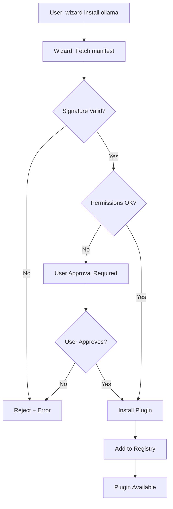

# Plugin Manifest Specification v1.3

**Status:** Spec complete (implementation target: v1.3.2)
**Scope:** Wizard Plugin Repository + Container System

---

## 1. Overview

All uDOS plugins/extensions distributed via Wizard must include a `manifest.json` at the root of their container definition.

**Location:** `/library/{plugin-name}/manifest.json`

---

## 2. Manifest Schema

```json
{
  "$schema": "https://udos.dev/schemas/plugin-manifest-v1.3.json",
  "id": "string (required)",
  "name": "string (required)",
  "version": "string (required, semver)",
  "description": "string (optional)",
  "author": {
    "name": "string (required)",
    "maintainer": "string (optional)",
    "url": "string (optional)"
  },
  "homepage": "string (optional, URL)",
  "repository": "string (optional, URL)",
  "license": "string (required, SPDX identifier)",
  "main": "string (required, entry point path)",
  "type": "enum (required)",
  "runtime": {
    "requires": "string (optional, core version)",
    "platform": ["array of strings (optional)"]
  },
  "permissions": {
    "filesystem": {
      "read": ["array of paths"],
      "write": ["array of paths"]
    },
    "network": {
      "allowed": "boolean",
      "domains": ["array of domains"]
    },
    "ai": {
      "models": ["array of model names"],
      "max_tokens": "number"
    }
  },
  "dependencies": {
    "containers": ["array of container IDs"],
    "plugins": ["array of plugin IDs"]
  },
  "signature": {
    "algorithm": "string (required, enum)",
    "publicKey": "string (required)",
    "signature": "string (required)"
  }
}
```

---

## 3. Field Definitions

### Core Identity

| Field | Type | Required | Description |
|-------|------|----------|-------------|
| `id` | string | ✅ | Unique identifier (reverse DNS: `com.example.plugin`) |
| `name` | string | ✅ | Human-readable name |
| `version` | string | ✅ | Semantic version (1.2.3) |
| `description` | string | ❌ | Short description (max 280 chars) |
| `license` | string | ✅ | SPDX license identifier (MIT, GPL-3.0, etc.) |

### Type Classification

```typescript
type PluginType =
  | "container"      // Docker/Podman container
  | "transport"      // Network/communication protocol
  | "extension"      // Core runtime extension
  | "theme"          // Visual theme pack
  | "knowledge"      // Knowledge base addon
  | "service";       // Background service
```

### Runtime Requirements

```json
{
  "runtime": {
    "requires": ">=1.3.0",
    "platform": ["linux", "darwin", "alpine"]
  }
}
```

**Platforms:**
- `linux` — Generic Linux (Debian, Ubuntu, etc.)
- `darwin` — macOS
- `alpine` — Alpine Linux (Sonic USB)
- `windows` — Windows 10/11
- `any` — Platform-agnostic

---

## 4. Permission Scopes

### Filesystem Permissions

```json
{
  "permissions": {
    "filesystem": {
      "read": ["~/uDOS/memory/vault", "/tmp"],
      "write": ["~/uDOS/memory/vault/_output"]
    }
  }
}
```

**Reserved Paths (Denied by Default):**
- `/memory/private/` — User secrets
- `/wizard/config/` — Wizard configuration
- `~/.ssh/` — SSH keys
- System directories (`/etc/`, `/bin/`, `/usr/`)

### Network Permissions

```json
{
  "permissions": {
    "network": {
      "allowed": true,
      "domains": ["api.openai.com", "ollama.local"]
    }
  }
}
```

**Rules:**
- `allowed: false` — No network access
- `allowed: true, domains: []` — Full internet access (requires approval)
- `allowed: true, domains: [...]` — Whitelist only

### AI Permissions

```json
{
  "permissions": {
    "ai": {
      "models": ["mistral-small", "llama3"],
      "max_tokens": 4096
    }
  }
}
```

---

## 5. Signature Requirements

All plugins distributed via Wizard **MUST** be signed.

### Signature Process

1. **Generate Key Pair:**
   ```bash
   openssl genrsa -out plugin-private.pem 2048
   openssl rsa -in plugin-private.pem -pubout -out plugin-public.pem
   ```

2. **Sign Manifest:**
   ```bash
   # Remove signature field from manifest temporarily
   cat manifest.json | jq 'del(.signature)' > manifest-unsigned.json

   # Generate signature
   openssl dgst -sha256 -sign plugin-private.pem \
     -out signature.bin manifest-unsigned.json

   # Encode as base64
   base64 -i signature.bin -o signature.txt
   ```

3. **Add Signature to Manifest:**
   ```json
   {
     "signature": {
       "algorithm": "RSA-SHA256",
       "publicKey": "-----BEGIN PUBLIC KEY-----\n...",
       "signature": "BASE64_ENCODED_SIGNATURE"
     }
   }
   ```

### Signature Algorithms (Allowed)
- `ED25519`
- `RSA-SHA256`

**Preferred:** `ED25519` for smaller keys and simpler verification.

### Canonicalization Rules (Required)
To avoid mismatched signatures, Wizard verifies a **canonical JSON payload**:
- UTF-8 encoded
- LF line endings
- Keys sorted lexicographically
- No trailing whitespace
- The `signature` field is **removed** prior to signing/verification

Wizard will reject manifests that cannot be canonicalized cleanly.

---

## 6. Wizard Verification Flow (Required)

1. **Parse manifest** and validate schema.
2. **Canonicalize** the manifest (remove `signature`, normalize JSON).
3. **Check trust** (public key is allowed).
4. **Verify signature** (algorithm + payload).
5. **Enforce permissions** (apply least-privilege defaults).
6. **Record audit log** (decision + fingerprint).

If any step fails, installation is **blocked**.

---

## 7. Trust Model + Key Registry

Wizard maintains a trusted key registry:

- **File:** `wizard/config/trusted-keys.json`
- **Format:** list of key fingerprints and owners
- **Scope:** global (system) + optional project-local allowlist

Example:
```json
[
  {
    "owner": "uDOS Official",
    "fingerprint": "ED25519:ab12cd34...",
    "publicKey": "-----BEGIN PUBLIC KEY-----\n..."
  }
]
```

**Rules:**
- Only manifests signed by trusted keys can be installed.
- Local development can use `--allow-unsigned` **only** when `wizard.dev_mode=true`.

---

## 8. Revocation + Key Rotation

Wizard supports a revocation list to block compromised keys:

- **File:** `wizard/config/revoked-keys.json`
- **Behavior:** installation/update is blocked if fingerprint matches.
- **Rotation:** new keys must be added to `trusted-keys.json` before plugins are updated.

Optional: Wizard can pull a signed revocation list from the official plugin repository.

---

## 9. Enforcement + Failure Handling

When signature verification fails:
- **Install:** blocked
- **Update:** blocked, previous version remains active
- **Runtime:** plugin is **disabled** and marked `signature_failed`

If permissions exceed policy (e.g., full network access):
- Wizard prompts the user for explicit approval before install.

---

## 10. Audit Logging

Wizard logs all signature decisions to:
- `wizard/logs/plugin-audit.log`

Each entry includes:
- plugin id + version
- public key fingerprint
- decision (`allow` | `deny`)
- reason

### Verification (Wizard)

Wizard verifies signatures before installation:

```python
def verify_plugin_signature(manifest: dict) -> bool:
    unsigned = {k: v for k, v in manifest.items() if k != 'signature'}
    public_key = manifest['signature']['publicKey']
    signature = base64.b64decode(manifest['signature']['signature'])

    # Verify using OpenSSL or cryptography library
    return verify_rsa_sha256(unsigned, public_key, signature)
```

---

## 6. Example Manifests

### Container Plugin (Ollama)

```json
{
  "$schema": "https://udos.dev/schemas/plugin-manifest-v1.3.json",
  "id": "ai.ollama.container",
  "name": "Ollama",
  "version": "0.1.0",
  "description": "Local LLM inference engine",
  "author": {
    "name": "Ollama Team",
    "url": "https://ollama.ai"
  },
  "license": "MIT",
  "main": "container.json",
  "type": "container",
  "runtime": {
    "requires": ">=1.3.0",
    "platform": ["linux", "darwin"]
  },
  "permissions": {
    "filesystem": {
      "read": [],
      "write": ["/tmp/ollama-models"]
    },
    "network": {
      "allowed": true,
      "domains": ["ollama.ai", "huggingface.co"]
    }
  },
  "dependencies": {
    "containers": [],
    "plugins": []
  },
  "signature": {
    "algorithm": "RSA-SHA256",
    "publicKey": "-----BEGIN PUBLIC KEY-----\nMIIBIjANBgkq...",
    "signature": "SGVsbG8gV29ybGQgU2lnbmF0dXJlCg=="
  }
}
```

### Transport Plugin (MeshCore)

```json
{
  "id": "com.udos.transport.meshcore",
  "name": "MeshCore P2P",
  "version": "0.1.0",
  "description": "Peer-to-peer mesh networking transport",
  "license": "GPL-3.0",
  "main": "transport.json",
  "type": "transport",
  "runtime": {
    "requires": ">=1.3.0",
    "platform": ["any"]
  },
  "permissions": {
    "network": {
      "allowed": true,
      "domains": []
    }
  },
  "signature": {
    "algorithm": "RSA-SHA256",
    "publicKey": "...",
    "signature": "..."
  }
}
```

---

## 7. Installation Flow



---

## 8. Wizard API Endpoints

### List Plugins
```http
GET /api/plugin/list
```

**Response:**
```json
{
  "plugins": [
    {
      "id": "ai.ollama.container",
      "name": "Ollama",
      "version": "0.1.0",
      "installed": true
    }
  ]
}
```

### Install Plugin
```http
POST /api/plugin/install
Content-Type: application/json

{
  "id": "ai.ollama.container",
  "approve_permissions": true
}
```

### Uninstall Plugin
```http
DELETE /api/plugin/uninstall/{plugin_id}
```

### Update Plugin
```http
POST /api/plugin/update/{plugin_id}
```

---

## 9. Security Model

### Threat Mitigation

| Threat | Mitigation |
|--------|------------|
| Malicious code | Signature verification required |
| Privilege escalation | Sandboxed permissions (read/write paths) |
| Network exfiltration | Domain whitelisting |
| Supply chain attack | Public key registry + community review |

### Community Review

Plugins submitted to the official repository undergo:
1. Automated security scan (malware, secrets)
2. Manifest validation
3. Signature verification
4. Community review period (7 days for new plugins)
5. Approval by maintainers

---

## 10. Future Enhancements (v1.4+)

- **Capability-based permissions** — Request only what's needed
- **Runtime sandboxing** — Seccomp/AppArmor profiles
- **Automatic rollback** — Revert on plugin failure
- **Dependency resolution** — Auto-install required plugins
- **Version pinning** — Lock plugins to specific versions

---

## 11. References

- **Container Schema:** `/library/container.schema.json`
- **Transport API:** `/library/extensions/README.md`
- **Wizard Plugin System:** `/docs/WIZARD-PLUGIN-SYSTEM.md`
- **Contribution Process:** `/docs/CONTRIBUTION-PROCESS.md`

---

**Status:** ✅ Production-ready for v1.3.0
**Next Review:** v1.3.1 (March 2026)
